# Post-Quantum Cryptographic Layer Architecture
## Secure Human-Robot Collaboration in Industry 5.0

This architecture diagram illustrates the comprehensive PQC implementation across all system layers: secure boot, secure communications, middleware integrity, and supporting infrastructure.

## System Overview Diagram

```mermaid
flowchart TB
    %% Styling
    classDef pqcLayer fill:#e1f5fe,stroke:#01579b,stroke-width:3px
    classDef secureLayer fill:#f3e5f5,stroke:#4a148c,stroke-width:2px
    classDef infraLayer fill:#e8f5e8,stroke:#1b5e20,stroke-width:2px
    classDef dataFlow stroke:#d32f2f,stroke-width:2px
    classDef keyFlow stroke:#ff6f00,stroke-width:2px,stroke-dasharray: 5 5

    %% Stakeholders & External Interfaces
    subgraph EXT[" 🧑‍💻 External Stakeholders & Interfaces"]
        HUMAN[Human Operator]
        DEVOPS[DevOps Engineer]
        ADMIN[Security Administrator]
    end

    %% Cloud Infrastructure & Services
    subgraph CLOUD[" ☁️ Cloud Infrastructure & Backend Services"]
        direction TB
        
        subgraph CICD[" 🔄 CI/CD Pipeline"]
            BUILD[Build Service]
            SIGN[PQC Firmware Signer<br/>🔐 Dilithium Signing]
            TEST[Automated Testing]
        end
        
        subgraph STORAGE[" 📦 Artifact & Key Storage"]
            REPO[(Signed Firmware Repository<br/>📁 .bin + .sig + metadata)]
            KEYSTORE[(Certificate Store<br/>🗝️ Public Keys & Certificates)]
        end
        
        subgraph SERVICES[" 🛠️ Backend Services"]
            API[Robot Control API]
            KMS[Key Management Service<br/>🔑 Provisioning, Rotation, Revocation]
            ANALYTICS[Analytics Engine<br/>📊 Future: FHE Privacy Analytics]
        end
        
        subgraph MONITOR[" 📈 Monitoring & Observability"]
            LOGS[(Log Aggregation)]
            METRICS[(Metrics & Telemetry)]
            ALERTS[Security Alerts]
        end
    end

    %% Secure Network Communication Layer
    subgraph NETWORK[" 🌐 Secure Communication Layer"]
        direction LR
        TLS[Hybrid TLS 1.3 Session<br/>🔒 Classical ECDH + PQC Kyber KEM<br/>📡 Forward & Post-Quantum Secure]
        
        subgraph PROTOCOLS[" 📋 Protocol Stack"]
            APP_PROTO[Application Protocols<br/>HTTP/2, gRPC, WebSocket]
            MSG_SIGN[Message-Level Signing<br/>🖊️ Dilithium Signatures]
            TRANSPORT[Transport Security<br/>TLS 1.3 + PQC Extensions]
        end
    end

    %% Robot Device Architecture
    subgraph ROBOT[" 🤖 Robot Device Architecture"]
        direction TB
        
        subgraph HARDWARE[" ⚙️ Hardware Security Layer"]
            TPM[TPM 2.0 / Secure Element<br/>🔒 Root of Trust<br/>🗝️ Private Key Storage]
            MCU[MCU/SoC<br/>ARM Cortex / x86<br/>Crypto Accelerators]
            SENSORS[Sensors & Actuators<br/>🎯 Vision, Lidar, Motors<br/>📡 Industrial I/O]
        end
        
        subgraph BOOT[" 🚀 Secure Boot Chain"]
            ROM[Boot ROM<br/>🔐 Hardware Root of Trust]
            BOOTLOADER[Secure Bootloader<br/>✅ PQC Signature Verification<br/>🔄 Recovery & Rollback<br/>📜 Dilithium Verify]
            FIRMWARE[Application Firmware<br/>🎯 Robot Control Logic<br/>📊 Telemetry Collection]
        end
        
        subgraph RUNTIME[" 💻 Runtime Environment"]
            OS[RTOS/Linux Kernel<br/>⚡ Real-time Scheduling<br/>🔧 Device Drivers]
            MIDDLEWARE[Middleware Layer<br/>🤝 ROS2/DDS Integration<br/>🖊️ Message Authentication<br/>📨 Dilithium Message Signing]
            NETWORKING[Network Stack<br/>🌐 TCP/IP, UDP<br/>🔒 TLS/DTLS + liboqs<br/>📡 Wireless Interfaces]
        end
    end

    %% Development & Testing Infrastructure
    subgraph TESTING[" 🧪 Development & Testing Infrastructure"]
        HIL[Hardware-in-Loop Testbench<br/>⚡ Automated Flash & Boot<br/>🔍 Security Validation<br/>📊 Performance Monitoring]
        SIM[Robot Simulator<br/>🎮 Virtual Environment<br/>🧪 Protocol Testing]
        TOOLS[Development Tools<br/>🔧 Firmware Signing CLI<br/>📋 Key Management Tools]
    end

    %% Data and Control Flows
    
    %% External User Interactions
    HUMAN -->|Monitor & Control| API
    DEVOPS -->|Deploy & Configure| CICD
    ADMIN -->|Manage Keys & Policies| KMS
    
    %% CI/CD Pipeline Flow
    BUILD -->|Build Firmware| SIGN
    SIGN -->|Sign with Dilithium| REPO
    TEST -->|Validate Signatures| HIL
    
    %% Key Management Flow
    KMS -.->|Provision Public Keys| TPM
    KMS -.->|Certificate Distribution| KEYSTORE
    KMS -.->|Key Rotation Events| BOOTLOADER
    
    %% Firmware Delivery & Boot Process
    REPO -->|OTA/USB Update| BOOTLOADER
    TPM -.->|Public Key Bundle| BOOTLOADER
    ROM --> BOOTLOADER
    BOOTLOADER -->|✅ Signature Valid| FIRMWARE
    BOOTLOADER -->|❌ Signature Invalid| BOOTLOADER
    
    %% Runtime Communication Flow
    FIRMWARE --> OS
    OS --> SENSORS
    FIRMWARE --> MIDDLEWARE
    MIDDLEWARE --> NETWORKING
    NETWORKING <-->|Hybrid TLS + Message Signing| TLS
    TLS <--> API
    
    %% Monitoring & Observability
    FIRMWARE -.->|Telemetry & Logs| LOGS
    BOOTLOADER -.->|Boot Events & Errors| LOGS
    MIDDLEWARE -.->|Message Audit Trail| LOGS
    SIGN -.->|Signing Events| LOGS
    LOGS --> METRICS
    METRICS --> ALERTS
    
    %% Testing & Validation
    HIL -.->|Flash & Reboot| BOOTLOADER
    HIL -.->|Functional Tests| FIRMWARE
    SIM -.->|Protocol Testing| NETWORKING
    TOOLS -.->|CLI Operations| SIGN

    %% Apply styling
    class TPM,BOOTLOADER,SIGN,MSG_SIGN,TLS pqcLayer
    class ROM,FIRMWARE,OS,API,KMS secureLayer
    class BUILD,REPO,LOGS,METRICS,HIL infraLayer
```

## Security Architecture Details

### 🔐 Post-Quantum Cryptographic Components

1. **Secure Boot Chain**
   - **Algorithm**: CRYSTALS-Dilithium (Level 2)
   - **Implementation**: Custom bootloader with PQC signature verification
   - **Key Storage**: TPM 2.0 or Secure Element for root public keys
   - **Fallback**: Recovery mode with rollback capability

2. **Secure Communications**
   - **Key Exchange**: Hybrid approach combining Classical ECDH (P-256) + PQC Kyber KEM
   - **Session Security**: TLS 1.3 with post-quantum extensions
   - **Message Authentication**: Per-message Dilithium signatures for critical commands
   - **Library**: OpenSSL + liboqs integration

3. **Middleware Security**
   - **ROS2 Integration**: DDS security plugins with PQC support
   - **Message Integrity**: Selective signing of critical control messages
   - **Key Management**: Automated key rotation and revocation support

### 🛡️ Security Layers & Responsibilities

| Layer | Security Function | PQC Algorithm | Key Management |
|-------|------------------|---------------|----------------|
| **Hardware** | Root of Trust, Key Storage | - | TPM 2.0 / Secure Element |
| **Boot** | Firmware Integrity | Dilithium | Public key verification |
| **Network** | Channel Security | Kyber + Classical ECDH | Session key derivation |
| **Application** | Message Authentication | Dilithium | Per-message signatures |
| **Infrastructure** | Code Signing, Audit | Dilithium | CI/CD key management |

### 📊 Performance Considerations

- **Boot Impact**: < 5% increase in boot time due to PQC verification
- **Network Overhead**: ~1-3ms additional handshake latency for hybrid TLS
- **Message Signing**: Selective signing strategy to minimize real-time impact
- **Resource Usage**: Optimized for embedded devices with limited memory/CPU

### 🔄 Key Lifecycle Management

1. **Provisioning**: Secure factory provisioning of device identity keys
2. **Rotation**: Automated key rotation with overlap periods
3. **Revocation**: Certificate revocation lists distributed via secure channels
4. **Recovery**: Offline recovery keys for emergency situations

## Implementation Status

### ✅ Completed Components
- **Firmware Signing Tool**: Python-based CLI with Dilithium support
- **Signature Verification**: Basic bootloader verification logic
- **Key Generation**: Dilithium keypair generation and management
- **Test Infrastructure**: Unit tests for signing/verification

### 🚧 In Progress
- **Hybrid TLS Implementation**: OpenSSL + liboqs integration
- **ROS2 Middleware Integration**: DDS security plugins
- **Hardware Security Module**: TPM 2.0 integration

### 📋 Planned Features
- **Key Management Service**: Automated provisioning and rotation
- **Privacy Analytics**: FHE-based secure analytics
- **Hardware-in-Loop Testing**: Automated security validation

## Detailed Sequence Diagrams

### Secure Boot Process Flow

### Secure Communication Establishment

### Key Rotation Process

## Viewing Instructions

- **GitHub**: Mermaid diagrams render automatically in GitHub Markdown
- **VS Code**: Install the "Mermaid Preview" extension for diagram viewing
- **Local Development**: Use `mermaid-cli` or online Mermaid editor for standalone viewing
